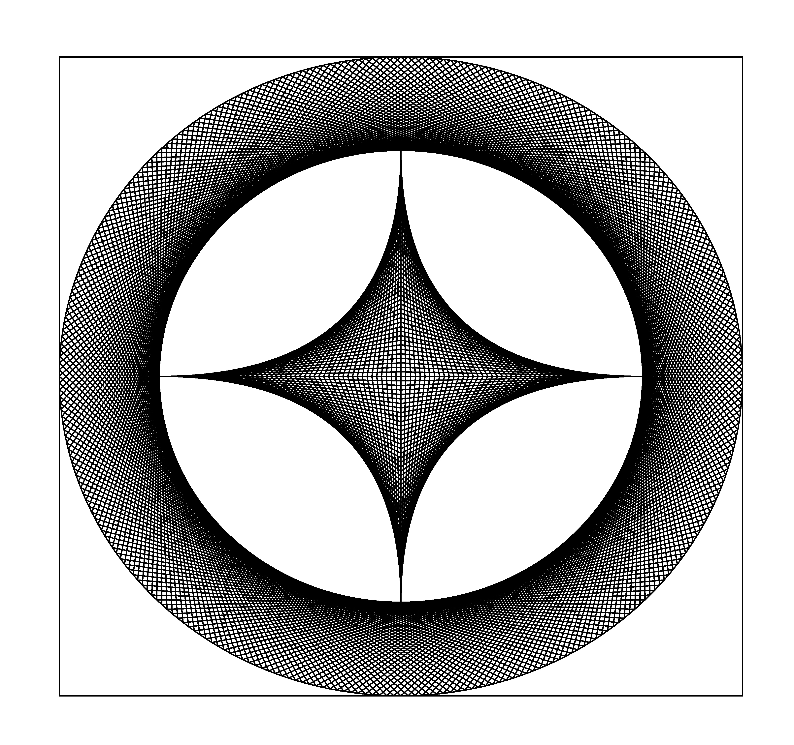
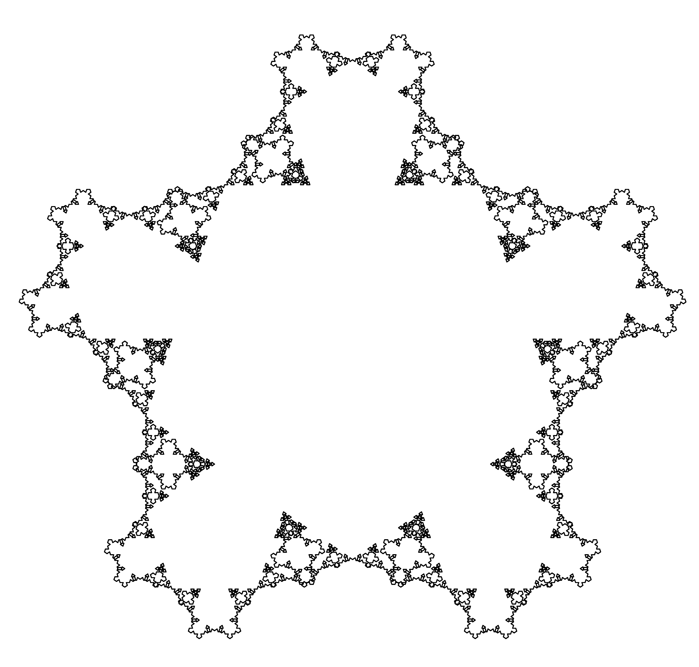

# Art
Messing with math and python to create cool art.
Specifically, there are Koch fractals, art from chaos games,
the mandelbrot set, and fancy 4 pointed stars.
The prettiest pieces, in my opinion, are shown here.
The rest can be found in the [Images](Images) directory.

